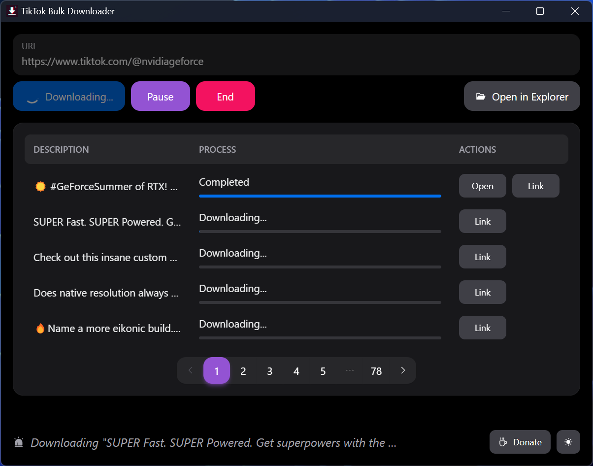

# TikTok Bulk Downloader

[**Download for Windows**](https://github.com/IDEX-Team/TikTok-Bulk-Downloader/releases/download/v0.0.3/TikTok.Bulk.Downloader_0.0.3_x64_en-US.msi) 🚀

**TikTok Bulk Downloader** is a powerful tool developed by **IDEX Team** that allows you to download multiple TikTok videos simultaneously at blazing speed. This software offers two convenient downloading modes:

1. **Download from Channel Link**:
   - Example: `https://www.tiktok.com/@{unique_id}`
2. **Download from Single Video Link**:
   - Example: `https://www.tiktok.com/@{unique_id}/video/{video_id}`

## Key Features

- **Bulk Download**: Supports downloading multiple videos at once, eliminating the need for repetitive processes.
- **Easy Management**: User-friendly interface for efficient management of your downloaded videos.
- **High Speed**: Take advantage of fast download speeds to save time and bandwidth.

## Demo

## How to Use

1. **Installation**: Download and install TikTok Bulk Downloader from the links above.
2. **Input Links**: Paste the URL of the TikTok channel or specific TikTok video into the input field and click "Start".
3. **Manage Downloads**: Videos will be automatically stored in the `Videos` directory, making it easy to manage and view your downloads.

Join our community to receive support and stay updated with the latest features!

## Development Team

**TikTok Bulk Downloader** is proudly developed and maintained by the **IDEX Team**.

## Contributions and Feedback

We welcome all contributions and feedback. If you encounter any issues or have ideas for improvements, please open a new [issue](https://github.com/IDEX-Team/TikTok-Bulk-Downloader/issues) on GitHub.
